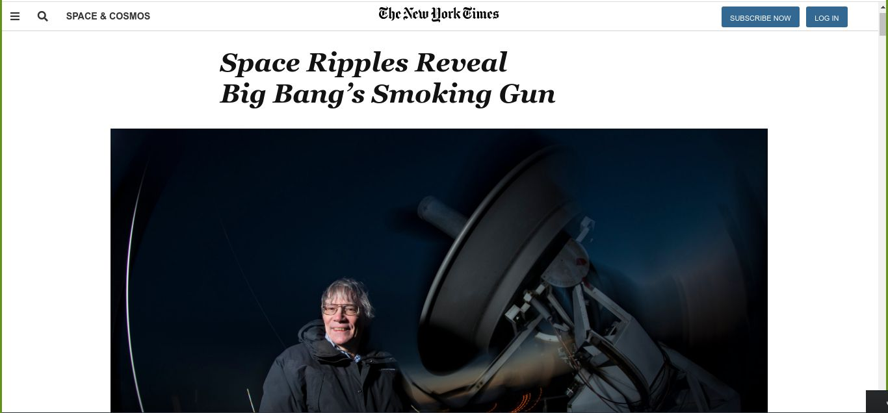
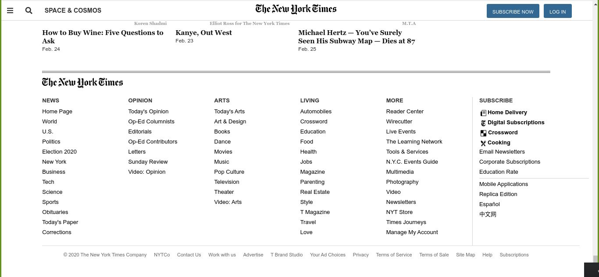

# Positioning and floating [Collaborative project]

> This project consists of building an HTML document that matches the appearance of Newyork times article page.
 
 
 

 

The purpose of this project is to clone the appearance of Newyork times article page using HTML and CSS.

## Built With

- HTML,
- CSS

## Live Demo

[Live Demo Link](https://raw.githack.com/OdongAlican/Newyork-times-article-page/)

## Getting Started

To get a local copy up and running follow these simple example steps.

### Prerequisites

#### You should have installed git on your local machine and a text editor preferably VS Code.

### Setup

#### Clone the repository into your local machine.

## Authors

👤 **Author1**

- Github: [@OdongAlican](https://github.com/OdongAlican)
- Twitter: [@odongsandie](https://twitter.com/odongsandie)
- Linkedin: [Sunday Alican odong](https://www.linkedin.com/in/sunday-alican-odong-b99226b7)

👤 **Author2**

- Github: [@phillipUg](https://github.com/phillipUg)
- Twitter: [@Phillip_Ug](https://twitter.com/Phillip_Ug)
- Linkedin: [Phillip Musiime](https://www.linkedin.com/in/phillip-musiime-74657019a/)

## 🤝 Contributing

Contributions, issues and feature requests are welcome!

Feel free to check the [issues page](issues/).

## Show your support

Give a ⭐️ if you like this project!

## Acknowledgments

- Appreciation to my coding Partner and mentor

## 📝 License

This project is [MIT](lic.url) licensed.
